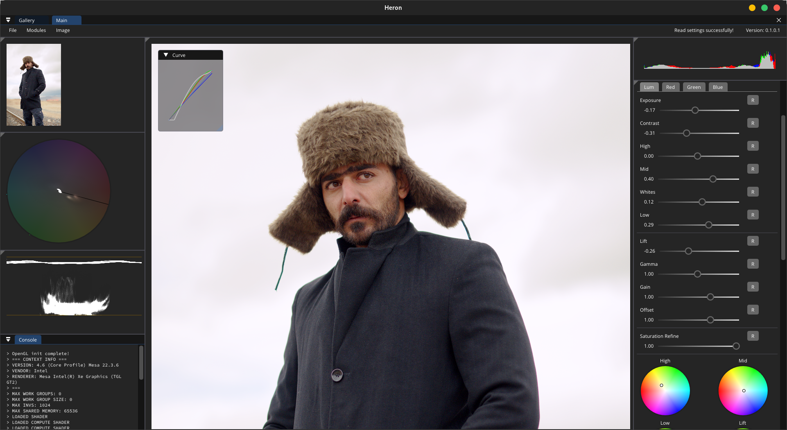

  
  <h1 align="center">Heron 
  Heron Edits Raw with Opengl Natively
  </h1>

 
 
 

## Contents

- [About](#about)
- [Features](#features)
- [Usage](#usage)
- [Download](#download)
- [Building from source](#building-from-source)
- [Documentation](#documentation)
- [Contributing](#contributing)

## About

Heron is an open source, free to use, raw image editor prioritising performance and ease of use, written in C++.

## Features

- Tone-curve based editing
- Intuitive colour wheels for advanced colour grading
- OpenGL shader based editing for ultra-fast performance
- Histogram, vectorscope and waveform graphics
- Automatic settings saving
- Local catalog to store edited photos

## Usage

### Keyboard shortcuts

| Key | Action |
| - | - |
| B | Show image before edits |
| ALT | Highlight image peaking/crush |
| SPACE | Toggle black/white background |
| SHIFT+SCROLL | Horizontal image pan |
| SHIFT+Hue select | Precision movement |

## Download

## Building from source

### Requirements

- OpenGL 4.3
- **Windows**
    - Visual Studio 20xx
- **Linux**
    - G++ ...
    - CMake 3.0.0+

### Windows

...

### Linux

...

## Documentation

## Contributing